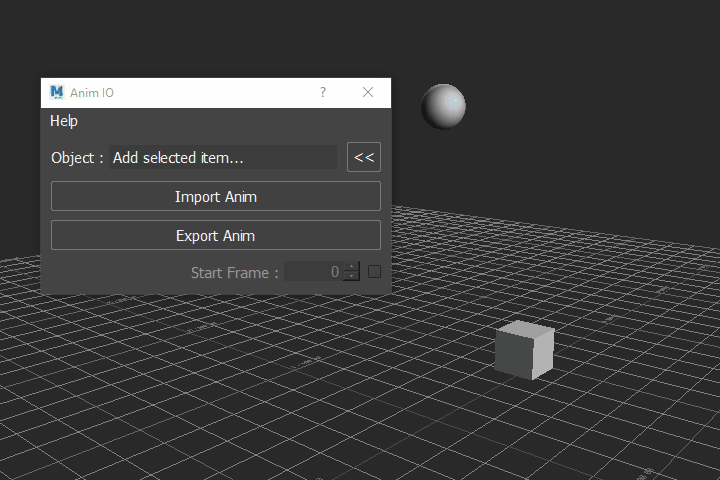

======
Usage
======
General usage goes as follows:

1. Run UI
2. Add selected object to export or import
3. Set Start Frame if needed for import (must click checkbox to use)
4. Press Import or Export
5. Set file path and press Open/Save

